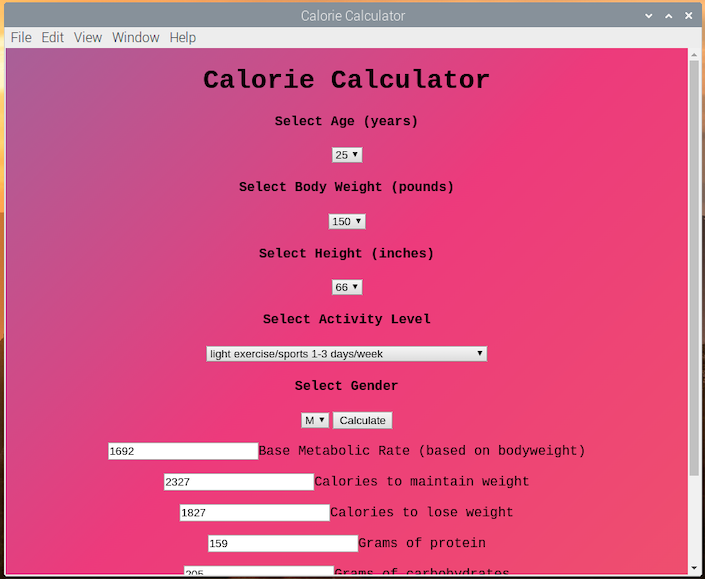

# Calorie Calculator Electron Desktop App

You will need to install the dependencies 'npm install'.
To test it out you can use 'npm start' after you setup nodejs.
To build it with electron you can use one of the following (based on your OS):
- npm run package-win
- npm run package-mac
- npm run package-linux

